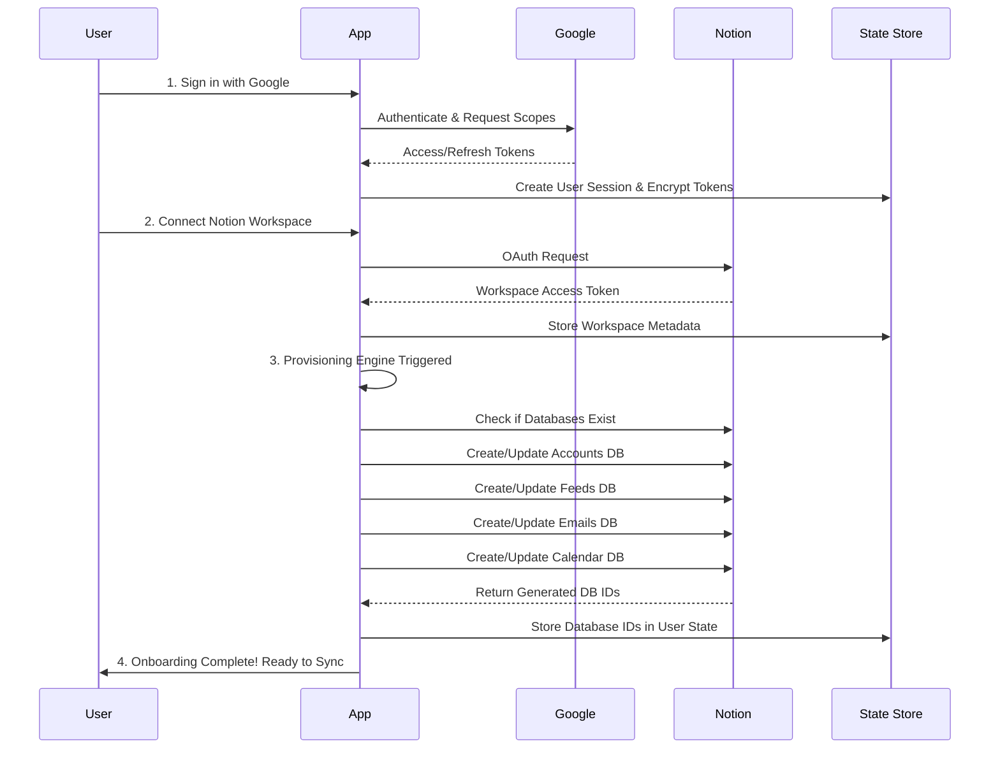

# Opportunity Mail Tracker - Technical Specification

## Project Overview

**Project Name:** Opportunity Mail Tracker
**Type:** Email organization and tracking system (Multi-User SaaS Architecture)
**Core Functionality:** A multi-inbox email intelligence layer that organizes career-related emails into structured feeds and automatically provisions and syncs to a user's chosen Notion workspace.
**Target Users:** Students, interns, developers, and professionals.
**Onboarding Goal:** Zero manual setup. Users authenticate via Google and Notion, and the system automatically provisions their workspace and manages runtime state.

---

## 1. System Architecture

The architecture has been refactored from a single-user developer script into a production-grade, multi-user system supporting automatic provisioning, multi-tenant state isolation, and zero-touch configuration for the end user.

### 1.1 High-Level Flow
```
┌─────────────────┐       ┌──────────────────────┐       ┌─────────────────┐
│  Google OAuth   │──────▶│   Onboarding Engine  │◀──────│  Notion OAuth   │
└─────────────────┘       └──────────┬───────────┘       └─────────────────┘
                                     │
                                     ▼
                          ┌──────────────────────┐       ┌─────────────────┐
                          │ Provisioning Engine  │──────▶│ Notion Workspace│
                          └──────────┬───────────┘       └─────────────────┘
                                     │
                                     ▼
                          ┌──────────────────────┐
                          │  User Runtime Config │
                          │     (Data Store)     │
                          └──────────┬───────────┘
                                     │
┌─────────────────┐       ┌──────────▼───────────┐       ┌─────────────────┐
│  Gmail APIs     │──────▶│     Sync Engine      │──────▶│ Notion API      │
└─────────────────┘       └──────────────────────┘       └─────────────────┘
```

### 1.2 Onboarding Sequence & Provisioning Flow


---

## 2. Configuration Architecture

Configuration is divided into three distinct layers to ensure users never touch environment files or handle sensitive keys.

### 2.1 Internal Application Config (`.env`)
These are platform-level variables managed only by the deployment environment.
```env
# Application Core
PORT=3000
NODE_ENV=production

# Platform Security
APP_ENCRYPTION_KEY=your-32-byte-secure-key
JWT_SECRET=your-jwt-secret

# Google OAuth App Credentials
GOOGLE_CLIENT_ID=
GOOGLE_CLIENT_SECRET=
REDIRECT_URIs=

# Notion OAuth App Credentials
NOTION_CLIENT_ID=
NOTION_CLIENT_SECRET=
NOTION_REDIRECT_URI=
```

### 2.2 User Runtime State (Dynamic)
All user-specific variables (database IDs, workspaces, API tokens, cursor sync state) are stored dynamically.
```json
{
  "userId": "usr_abc123",
  "email": "user@example.com",
  "notion": {
    "workspaceId": "ws_xyz789",
    "databases": {
      "accounts": "db_111",
      "feeds": "db_222",
      "emails": "db_333",
      "calendar": "db_444"
    }
  },
  "syncState": {
    "gmailAccounts": {
      "user@example.com": {
        "historyId": "987654321",
        "lastProcessedMessageId": "msg_abc123"
      }
    }
  }
}
```

### 2.3 OAuth & Credentials
- Users never provide OAuth Client IDs or Client Secrets.
- Access and Refresh tokens are securely stored inside the **User Runtime State** after the OAuth handshake.
- Tokens are encrypted at rest using `AES-256-GCM` and the `APP_ENCRYPTION_KEY`.

---

## 3. Provisioning Engine Design

The Provisioning Engine replaces manual template duplication. It is responsible for creating databases, validating schemas, and applying migrations.

### 3.1 Idempotent Database Creation
- **Check State:** Queries Notion to see if required DBs exist in the connected workspace.
- **Create Missing:** If missing, creates the database using the defined API schema.
- **Store IDs:** Saves the newly generated `database_id`s to the `User Runtime State`.

### 3.2 Schema Validation & Auto-Migration
- **Detection:** On startup or periodic syncs, the system validates the properties of existing databases against the codebase schema.
- **Auto-Migration:** If properties are missing (e.g., a new "Summary" column was added in v2.0), the engine automatically calls Notion's `Update Database` API to append the missing columns without touching existing data.

---

## 4. Multi-User Architecture

The backend supports multiple users with strict data isolation.

### 4.1 User Session Model
- Sessions managed via HTTP-only cookies or Bearer JWTs linking requests to a unique `userId`.
- All operations (Auth, Sync, Provisioning) are scoped to this `userId`.

### 4.2 Token Isolation & Security Boundaries
- Google/Notion tokens are stored individually per user.
- A user's background sync job loads ONLY their specific `workspace_id`, `database_id`s, and `tokens`.
- Cross-user contamination is prevented by injecting the user context at the top-level sync orchestrator.

---

## 5. Notion Databases (Auto-Provisioned Schemas)

The core properties remain the same, but the burden of creating them is fully automated.

### 5.1 Accounts Database
| Property | Type | Description |
|----------|------|-------------|
| Email (title) | Title | Primary identifier |
| Account Name | Text | User label |
| Status | Select | Active/Disconnected |
| Last Sync | Date & Time | Timestamp of last successful batch |
| Gmail History ID | Text | Cursor for incremental sync |
| Last Message ID | Text | Fallback cursor |

### 5.2 Feeds Database
| Property | Type | Description |
|----------|------|-------------|
| Feed Name (title) | Title | |
| Domains | Multi-select | |
| Keywords | Multi-select | |
| Accounts | Multi-select | |

### 5.3 Emails Database
| Property | Type | Description |
|----------|------|-------------|
| Subject (title) | Title | Email subject |
| Sender Email | Email | From address |
| Received Date | Date | ISO Timestamp |
| Feeds | Multi-select | Tagged feeds |
| Message ID | Text | Primary Dedupe Key |
| Duplicates | Relation | Self-relation to canonical email |

### 5.4 Calendar Events Database
| Property | Type | Description |
|----------|------|-------------|
| Event Title (title)| Title | Event name |
| Event Date | Date | When the event happens |

---

## 6. Security Model & Best Practices

1. **Token Lifecycle:** 
   - Refresh tokens are automatically used to rotate short-lived access tokens.
   - All tokens are symmetrically encrypted at rest (`APP_ENCRYPTION_KEY`).
2. **Permission Boundaries:** 
   - Notion integration uses explicit OAuth flows requesting only read/write access to the specific connected workspace.
3. **No User Secrets:** 
   - Users are never exposed to encryption keys, client secrets, or raw database IDs.

---

## 7. MVP vs Production Roadmap

### 7.1 MVP (Next Iteration)
- **Runtime:** Local Node.js / single-instance deployment.
- **Onboarding:** Automated via local UI flow / simple frontend.
- **Provisioning:** Idempotent database creation.
- **Sync Model:** Polling sync (cron-based fetching per user).
- **Storage:** Local SQLite or structured JSON data store.

### 7.2 Future Production (SaaS Ready)
- **Architecture:** Distributed workers (e.g., BullMQ) handling sync queues.
- **Sync Model:** Webhook-based Gmail sync (Google Cloud Pub/Sub push notifications).
- **Hosting:** Fully hosted multi-tenant backend with a Next.js/React frontend dashboard.
- **Database:** Managed PostgreSQL for Runtime State & Token Management.
- **Scaling:** Horizontal auto-scaling of worker nodes.
